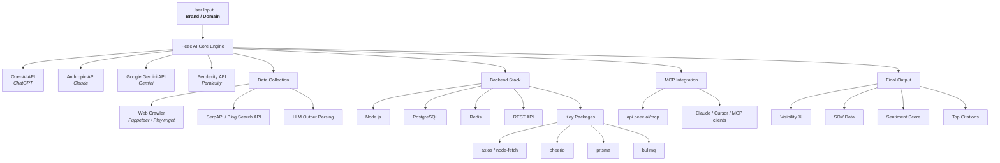

# Peec AI Architecture Explainer

> **Note:** This document describes the **conceptual architecture of the original Peec AI product** — what it does and the kind of components a clone would need. It is **not** a description of this repository's current code. For the actual state of this codebase, see [../CODEBASE.md](../CODEBASE.md). For the planned stack of this clone, see [../CLAUDE.md](../CLAUDE.md).

## Peec AI kya karta hai?

Peec AI ek **AI visibility tracker** tool hai. Yeh dekhta hai ki **aapka brand ChatGPT, Perplexity, Claude, Gemini** jaise AI tools mein kitna mention hota hai.

**Important Clarification:** Peec AI khud koi search engine nahi banata. Yeh existing AI platforms aur search APIs ka use karke data collect karta hai. Yeh sirf monitor karta hai ki AI tools mein aapka brand kitna visible hai.

---

## Step-by-Step Architecture

### Step 1 — Aap apna domain/brand dete ho

Jaise `thriveagency.com` ya `Thrive Internet Marketing` screenshot mein diya gaya hai.

### Step 2 — Peec AI Core Engine

Yeh engine **AI platforms ko query karta hai**. Basically AI se poochta hai:

- "Kaunse SEO agencies best hain?"
- "Kis brand ka mention hai?"

Fir dekhta hai ki aapka brand mention hua ya nahi.

### Step 3 — Third-party AI APIs use hoti hain

- **OpenAI API** → ChatGPT ke responses monitor karne ke liye
- **Anthropic API** → Claude ke responses ke liye
- **Google Gemini API** → Google AI ke liye
- **Perplexity API** → Perplexity Search ke liye

### Step 4 — Data collection ka tarika

- **Web Crawler** (Puppeteer/Playwright) → websites crawl karta hai
- **SerpAPI / Bing Search API** → search results fetch karta hai
- **LLM output parsing** → AI ke jawab ko parse karke brand dhundta hai

### Step 5 — Backend Stack

- **Node.js** → server runtime
- **PostgreSQL** → brand aur competitor data store karta hai
- **Redis** → fast caching aur background job queue
- **REST API** → frontend ko data deta hai

### Step 6 — Key npm Packages

- `axios` / `node-fetch` → HTTP calls ke liye
- `cheerio` → HTML parse karne ke liye
- `prisma` → database ORM
- `bullmq` → background jobs (har raat crawl karna etc.)

### Step 7 — MCP Integration

`api.peec.ai/mcp` → yeh **MCP server hai** jise aap **Claude, Cursor ya kisi bhi MCP-compatible tool** se connect kar sakte ho.

Iska matlab:

- Aap directly Claude se pooch sakte ho: "Mera brand AI mein kahan hai?"
- Peec real-time data deta hai.

### Step 8 — Final Output

- **Visibility %** — brand AI discussions mein kitna appear hota hai
- **SOV (Share of Voice)** — competitors ke comparison mein
- **Sentiment Score** — positive/negative tone
- **Top Citations** — kaunsi websites AI cite kar rahi hain

---

## Architecture Diagram

---

## Notes

Yeh setup aapko clear karta hai ki Peec AI:

- AI APIs se data leta hai
- crawlers aur search APIs se context build karta hai
- backend mein data store aur cache karta hai
- MCP-compatible endpoints se real-time AI queries support karta hai
- aur akhir mein brand visibility metrics aur citations dikhata hai

---

## Licenses aur API Requirements

Peec AI khud koi search engine nahi banata — yeh third-party tools ka smart use karta hai:

- **API Keys Required:**
  - OpenAI API key (ChatGPT access)
  - Anthropic API key (Claude access)
  - Google Gemini API key
  - Perplexity API key
  - SerpAPI key (ya Bing Search API)

- **No Special Licenses:** Yeh open-source tools (Puppeteer, Playwright) use karta hai, jo MIT license ke under free hain. API keys ke liye paid plans chahiye hote hain.

- **How It Works (No Custom Search Engine):**
  - Yeh AI se queries karta hai aur responses parse karta hai
  - Websites crawl karke context collect karta hai
  - Search APIs se rankings data leta hai
  - Sabko combine karke visibility score calculate karta hai
